# Lusion.co — User Journey Breakdown (reference for reproduction)

> Source: <https://lusion.co/> · Awwwards reference: <https://www.awwwards.com/sites/lusion-v3>
> Captured headlessly (Chrome + SwiftShader WebGL + Playwright) on a 1440×900 desktop and a
> 390×844 mobile viewport. Frames live in [`reference/`](./reference). Reproduce/refresh with
> `node scripts/capture-reference.mjs`. Slideshow: [`reference/journey_desktop.mp4`](./reference/journey_desktop.mp4).
>
> The site is **scroll-jacked** (Lenis virtual scroll): scroll position is intercepted and fed to a
> single full-screen WebGL canvas. 3D objects are positioned to match the bounding boxes of HTML
> layout elements (their documented ["WebGL Scroll Sync"](https://github.com/lusionltd/WebGL-Scroll-Sync)
> approach). A post-processing **mouse-displacement** pass distorts the rendered WebGL around the
> cursor. DOM text stays real HTML (SEO-friendly); only the visuals are WebGL.

---

## Global mechanics (apply across the whole site)

| Mechanic | Description | Reproduction |
|---|---|---|
| Single WebGL canvas | One fixed full-viewport canvas behind the DOM; everything 3D renders here. | One persistent R3F `<Canvas>` mounted client-only (`dynamic ssr:false`). |
| DOM-driven layout | 3D objects track HTML element rects (responsive flex/grid). | `screenToWorld` helper maps `getBoundingClientRect()` → world space each frame. |
| Smooth/virtual scroll | Inertia scrolling, scroll progress drives animations. | `lenis` + single rAF loop feeding GSAP `ScrollTrigger`. |
| Mouse displacement | Rendered WebGL ripples/displaces around the cursor. | Custom fullscreen post-processing pass (radial displacement) via `@react-three/postprocessing`. |
| Custom cursor | Native cursor hidden; custom dot/ring follows pointer, reacts to hover. | `Cursor.tsx` (only on `pointer:fine`). |
| Corner "+" marks | Thin `+` registration marks frame WebGL "windows". | `CornerMarks.tsx`. |
| Header | `LUSION` wordmark · mute `—` · `LET'S TALK •` pill · `MENU ••` pill. Collapses to wordmark + circular menu button on mobile. | `Header.tsx` + `MenuOverlay.tsx`. |
| Palette | Light lavender (`~#e9e7ff`) base, cobalt blue (`~#1a25ff`) accent, near-black, off-white; dark sections for the cinematic/CTA. | CSS tokens in `globals.css`. |

---

## 0 · Preloader
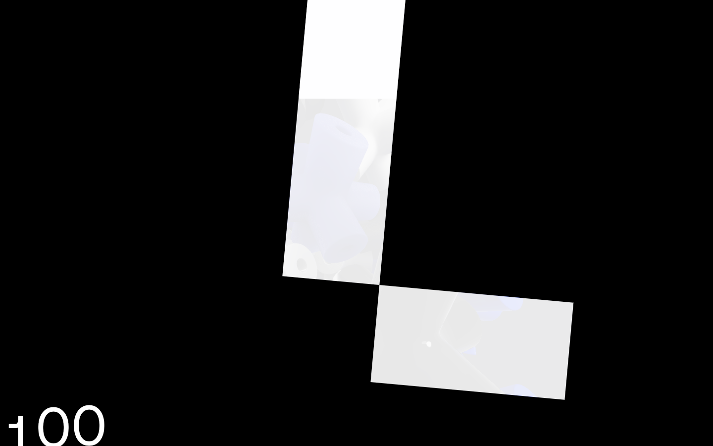

- **Visual:** black screen; a glossy white **"L"** assembles from rounded glossy panels (the same
  "jack"/cross material as the hero). A numeric counter runs up to **100** (bottom-left).
- **Interaction:** none; gates entry until assets/WebGL are ready.
- **Animation:** counter 0→100 tied to load progress; on complete, a reveal wipe transitions into
  the hero.
- **Reproduction:** `Preloader.tsx` using drei `useProgress` for the counter + a GSAP reveal.

## 1 · Hero — interactive "jack pit"
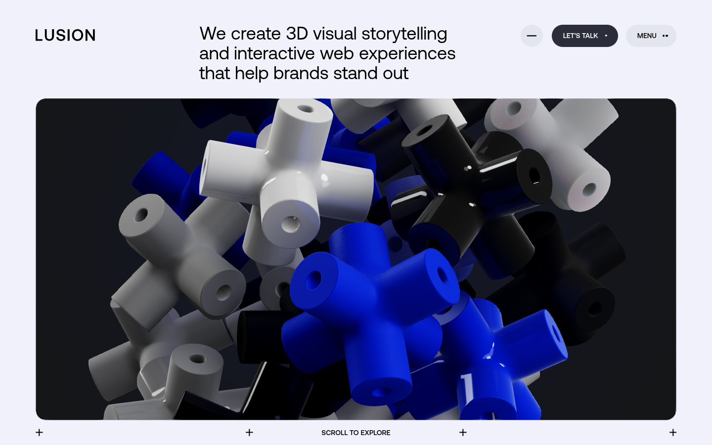

- **Visual:** light lavender section. Big heading: *"We create 3D visual storytelling and
  interactive web experiences that help brands stand out."* A large **rounded-rect dark window**
  holds a **physics pile of glossy "jack/cross" shapes** in cobalt blue / white / black / grey with
  sharp reflections. `SCROLL TO EXPLORE` below; `+` marks at the window corners.
- **Interaction:** moving the pointer pushes/scatters the jacks (amplified impulse); the
  displacement post-pass ripples the whole window around the cursor.
- **Mobile** (`reference/mobile/m_0.png`): portrait full-width rounded window, taller pile; header
  collapses to wordmark + menu button.
- **Reproduction:** Rapier rigid-body jacks (procedural geometry, glossy material + env reflections)
  inside a **stencil-masked** rounded window anchored to the hero DOM element; pointer-following
  repulsion collider.

## 2 · Bold Ideas, Brought to Life
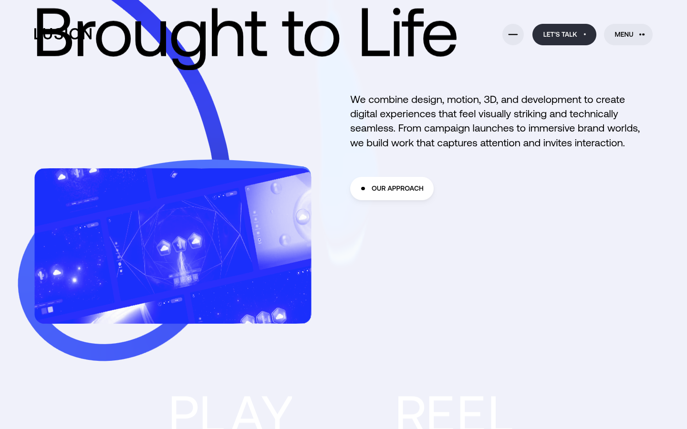

- **Visual:** huge kinetic heading *"Bold Ideas, Brought to Life"* slides through; a flowing
  **cobalt 3D ribbon/tube** curves across; a rounded **WebGL preview window** (data-viz-ish scene);
  body copy *"We combine design, motion, 3D, and development…"*; an `OUR APPROACH` pill. A large
  kinetic **"PLAY REEL"** wordmark rises into view.
- **Animation:** heading + words animate on scroll (staggered translate/clip); ribbon slowly flows
  / is scroll-linked.
- **Reproduction:** GSAP ScrollTrigger kinetic type; `Ribbon.tsx` `TubeGeometry` along a curve.

## 3 · Play Reel
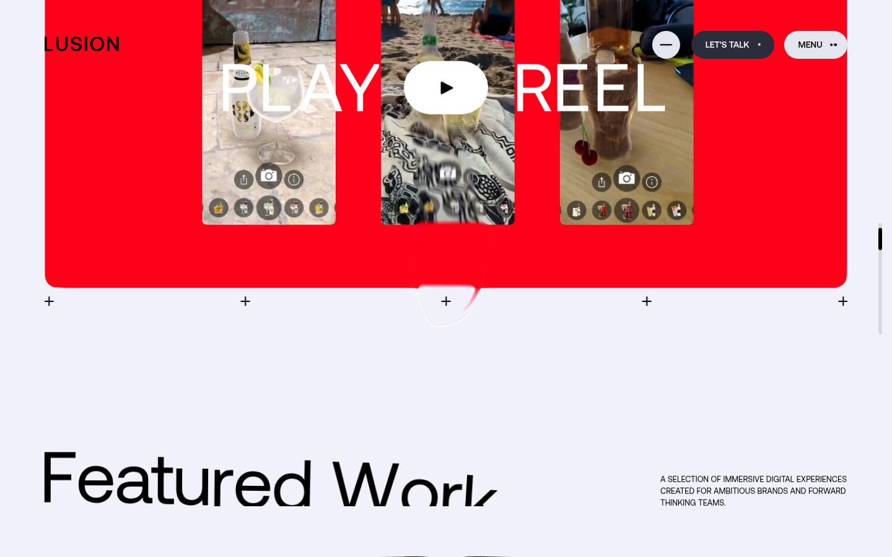

- **Visual:** full-bleed **red** showreel block with phone mockups and a central **play button**;
  kinetic "PLAY / REEL" type; `+` corner marks.
- **Interaction:** click play → showreel video.
- **Reproduction:** `PlayReel.tsx` with a looping CC0 video, kinetic text, play control; pauses
  offscreen.

## 4 · Featured Work
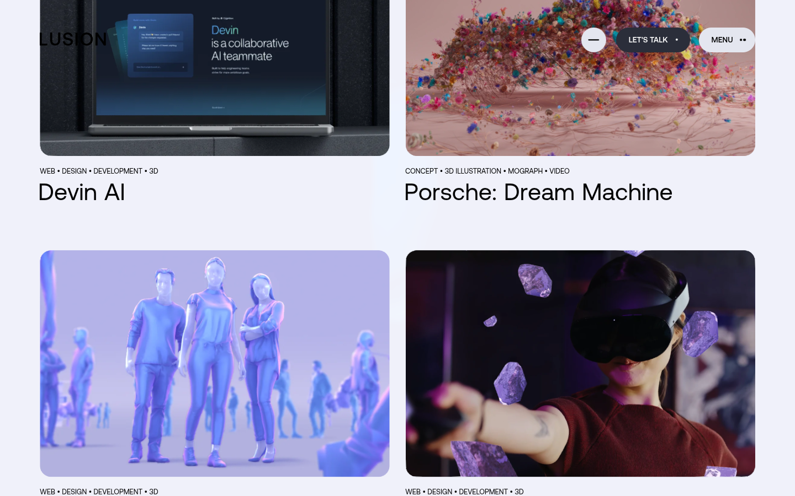
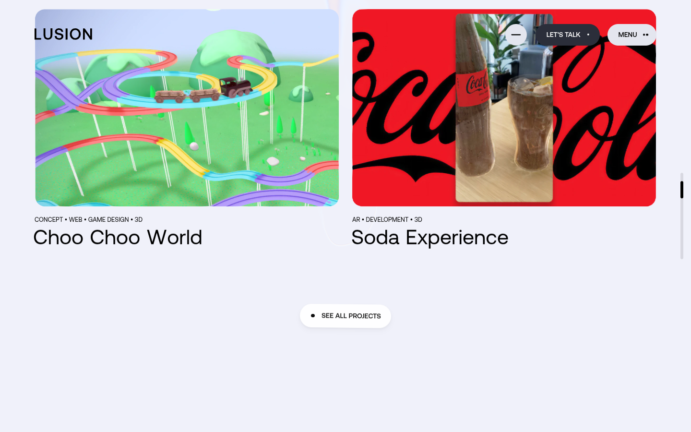

- **Visual:** heading **"Featured Work"** + subtitle *"A selection of immersive digital experiences
  created for ambitious brands and forward-thinking teams."* A **2-column project grid**; each card
  has a media thumbnail, a category tag row (e.g. `WEB • DESIGN • DEVELOPMENT • 3D`) and a title.
  Observed projects: *Devin AI, Porsche: Dream Machine, Synthetic Human, Meta: Spatial Fusion,
  Choo Choo World, Soda Experience, Spaace – NFT Marketplace*. `SEE ALL PROJECTS` pill.
- **Interaction:** hover plays a muted looping video; cards lift slightly.
- **Mobile** (`reference/mobile/m_2.png`): single column; media + tags + title + `→` arrow.
- **Reproduction:** `FeaturedWork.tsx` + `ProjectCard.tsx`; CC0 posters/videos; hover crossfade.

## 5 · Step Into a New World (pinned cinematic)
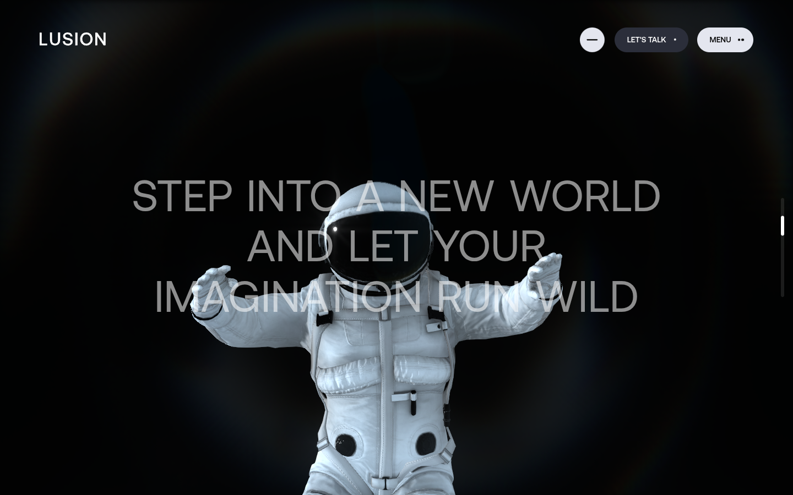
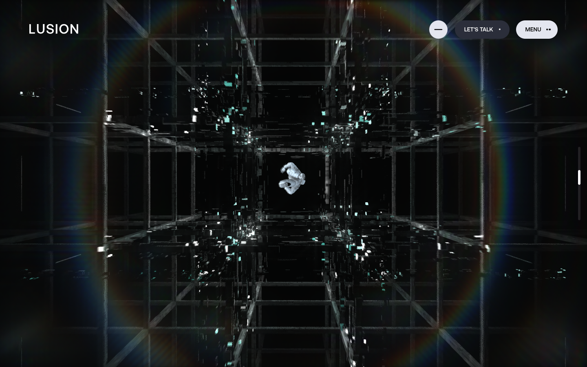
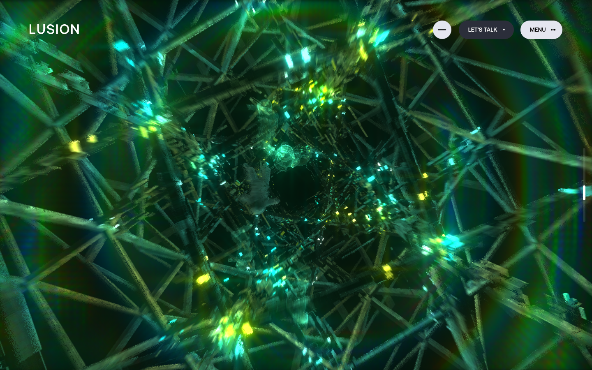

- **Visual:** a long, **pinned** scroll-driven sequence. An **astronaut** floats while the camera
  dollies through three "worlds": **dark space** → a glitchy **wireframe grid / data tunnel** →
  a **green crystalline cave**. A strong **chromatic-aberration / lens-flare ring** vignette frames
  the edges. Overlaid text *"STEP INTO A NEW WORLD AND LET YOUR IMAGINATION RUN WILD"* fades from
  grey to white.
- **Interaction:** purely scroll-driven; progress maps to camera position + world crossfades.
- **Reproduction:** `NewWorld.tsx` (GSAP pinned) + `AstronautJourney.tsx` (CC0 GLTF astronaut + 3
  procedural environments + scroll-linked camera) + chromatic/bloom post.

## 6 · Let's Work Together (sticker CTA)
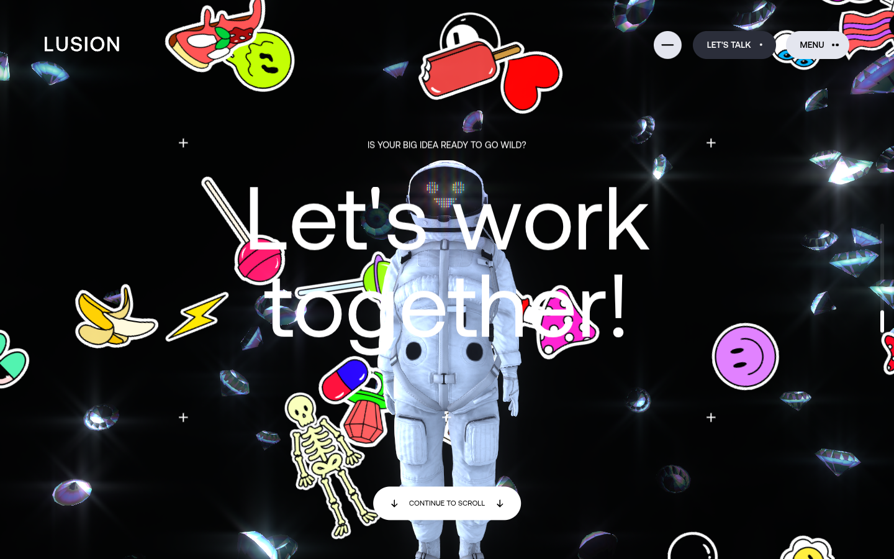

- **Visual:** dark section. An astronaut with an **LED "smiley" helmet**, surrounded by a cloud of
  floating **physics sticker** assets (skeleton, banana, lollipop, diamonds, smiley, lightning,
  ice-cream, hearts…). Eyebrow *"IS YOUR BIG IDEA READY TO GO WILD?"*, big **"Let's work together!"**,
  `CONTINUE TO SCROLL`; `+` marks.
- **Interaction:** stickers float / react to pointer; physics-based.
- **Reproduction:** `StickerField.tsx` (Rapier billboards) + astronaut + kinetic text.

## 7 · Footer + "About Us" teaser
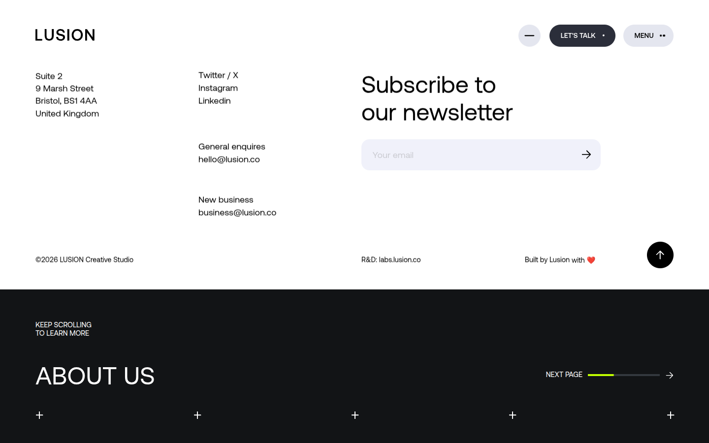

- **Visual (light):** `LUSION`; address (*Suite 2, 9 Marsh Street, Bristol BS1 4AA, United
  Kingdom*); socials (*Twitter/X, Instagram, LinkedIn*); *General enquiries* `hello@lusion.co`;
  *New business* `business@lusion.co`; **Subscribe to our newsletter** with an email input;
  *© 2026 LUSION Creative Studio*; *R&D: labs.lusion.co*; *Built by Lusion with ❤*; a circular
  scroll-to-top button.
- **Then (dark):** an **"ABOUT US"** next-page teaser — *"KEEP SCROLLING TO LEARN MORE"* with a
  *"NEXT PAGE"* progress bar — which transitions to the next route.
- **Reproduction:** `Footer.tsx` (client newsletter input, scroll-to-top) + dark teaser linking
  `/about` via a `template.tsx` page transition.

---

## Reproduction scope notes
A 1:1 clone is a ~1-year studio effort; this project recreates the **full journey and the signature
effects** at curated fidelity using **open-source / placeholder assets** (procedural geometry, CC0
astronaut GLTF, CC0 videos, drei environment maps) that are easy to swap. See [`PLAN.md`](./PLAN.md).
